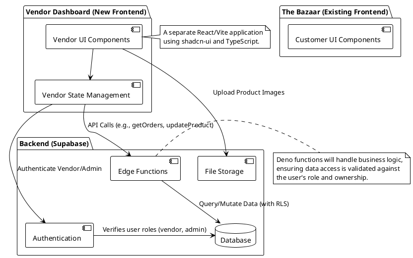
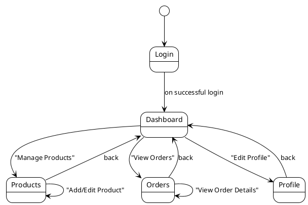
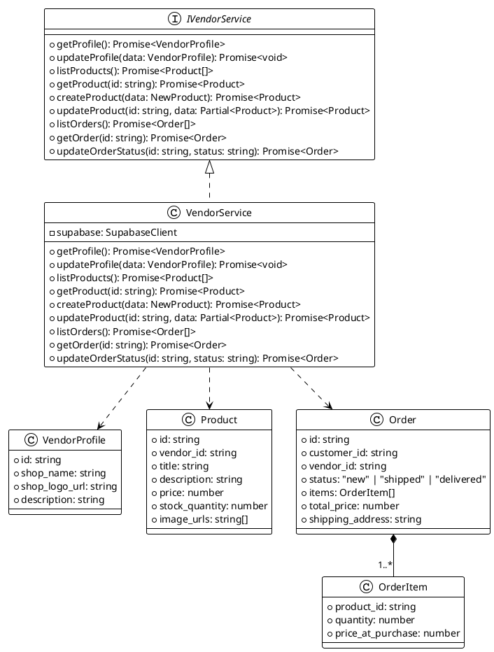
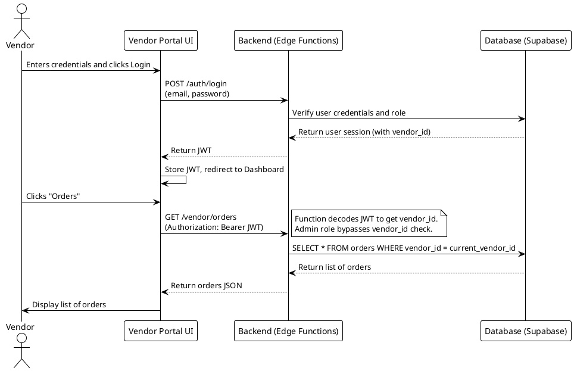
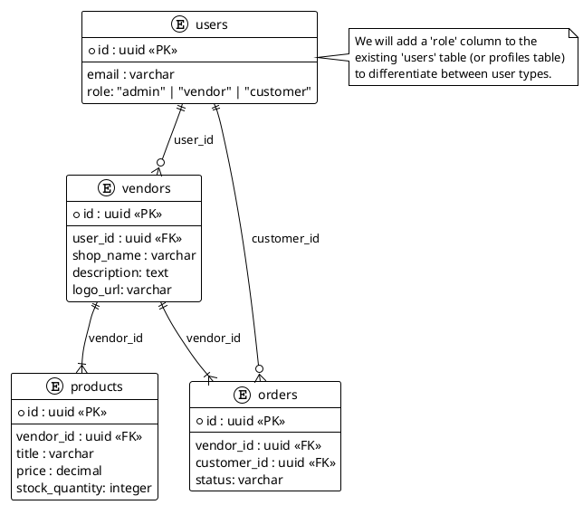

# System Design: Vendor Dashboard

**Author:** Bob, Architect
**Date:** 2025-10-31
**Status:** Initial Draft

## 1. Implementation Approach

We will develop a new, standalone frontend application for the Vendor Dashboard using React, Vite, and shadcn-ui. This approach ensures a clean separation from the customer-facing storefront, simplifying development, deployment, and security.

The backend will leverage our existing Supabase project. We will enforce strict access control using a combination of Supabase's Row Level Security (RLS) policies and business logic within Deno Edge Functions. A `role` field will be added to the user profiles to manage permissions for `vendor` and `admin` users.

Development will follow the phased approach from the PRD, starting with the **Basic (MVP)** features.

## 2. Main User-UI Interaction Patterns

- **Login:** A vendor or admin enters their credentials on a dedicated login page for the vendor portal.
- **Dashboard View:** Upon login, the user sees a main dashboard (initially simple, later with analytics) with clear navigation to other sections.
- **Product Management:** Vendors can view a table of their products, click to add a new one (opening a form in a dialog or new page), or edit an existing one.
- **Order Management:** Vendors view a list of their incoming orders, with options to click into an order to see details and update its fulfillment status.

## 3. Architecture

The system consists of a new **Vendor Dashboard Frontend**, the existing **Supabase Backend**, and the existing **Customer Frontend**. The new frontend will be a separate single-page application that communicates with Supabase for authentication, data, and file storage.

## 4. UI Navigation Flow

The navigation is designed to be flat and intuitive, focusing on the core tasks of a vendor.

## 5. Data Structures and Interfaces (Class Diagram)

The core data models include `VendorProfile`, `Product`, and `Order`. A `VendorService` class will encapsulate the logic for interacting with the backend.

## 6. Program Call Flow (Sequence Diagram)

This diagram illustrates the sequence for a vendor fetching their orders, highlighting the security checks involved.

## 7. Database ER Diagram

To support the vendor dashboard, we will introduce a `vendors` table and add a `role` column to the `users` (or `profiles`) table.

## 8. Unclear Aspects or Assumptions

- **Admin Access Mechanism:** We assume admins will access vendor data through a dedicated "Admin View" within the same vendor portal, where they can search for or select a vendor to view their specific dashboard. The exact UI for this is TBD.
- **Database Schema:** The ER diagram assumes we will modify the existing `users` or `profiles` table. The exact implementation will depend on the current schema, which needs to be confirmed from `supabase/schema.sql`.
- **Payouts:** The MVP design defers the financial/payout features. The database schema will need significant additions to support transaction ledgers and payout records in the future.